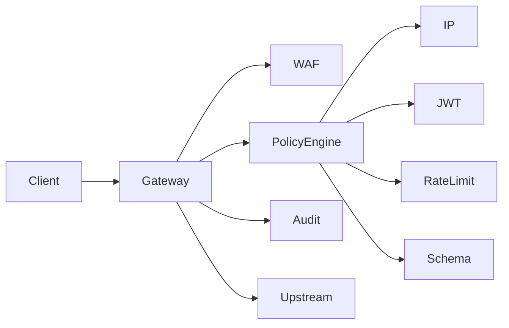

# API Security Gateway

A production-ready reverse proxy that enforces security policies on inbound API traffic before it ever reaches your SaaS or internal services.

## Typical Use Cases

- Protect public APIs without building a full security team
- Centralize rate limiting and JWT validation across microservices
- Apply WAF-lite rules at the edge for internal platforms

## Security Policies Implemented

- Rate limiting (per IP, per API key, per user)
- IP allow/deny lists with CIDR support
- JWT validation (issuer, audience, expiration, JWKS)
- OpenAPI request schema validation
- WAF-lite payload checks (SQLi, XSS, traversal)
- Structured audit logging

## Request Flow



## Quickstart (Docker Compose)

```bash
docker compose up --build
```

- Gateway: `http://localhost:8080`
- Echo backend: `http://localhost:9000`
- Admin API: `http://localhost:8080/admin`

## Example Policy Definitions

Create policies with the admin API, then assign them to routes.

```json
{
  "name": "Per-IP Rate Limit",
  "type": "rate_limit",
  "configJson": "{\"scope\":\"ip\",\"capacity\":100,\"refillPerSecond\":5,\"windowSeconds\":60}",
  "enabled": true
}
```

```json
{
  "name": "JWT Required",
  "type": "jwt",
  "configJson": "{}",
  "enabled": true
}
```

```json
{
  "name": "OpenAPI Validation",
  "type": "schema_validation",
  "configJson": "{\"openApiSpec\":\"echo.yaml\"}",
  "enabled": true
}
```

## Performance Considerations

- Use Redis for shared rate limiting in multi-instance deployments
- Cache route and policy definitions (default refresh every 30s)
- Tune Netty timeouts and connection pools for upstream SLAs
- Keep WAF patterns tight to reduce false positives

## Extension Points

- Add new `PolicyEvaluator` implementations in `/policy/impl`
- Replace the rate limiter with adaptive logic
- Integrate a SIEM exporter via `/audit`

## Professional Services

- Custom WAF rules and rule tuning
- Advanced threat detection and anomaly modeling
- SIEM integration (Splunk, Elastic, Sentinel)
- Zero-trust and mTLS integration
- Performance tuning and capacity planning
- Penetration testing of protected APIs

## Documentation

- `docs/ARCHITECTURE.md`
- `docs/ADMIN_API.md`
- `docs/THREAT_MODEL.md`
- `docs/POLICY_ENGINE.md`
- `docs/DEPLOYMENT.md`
- `docs/LIMITATIONS.md`
