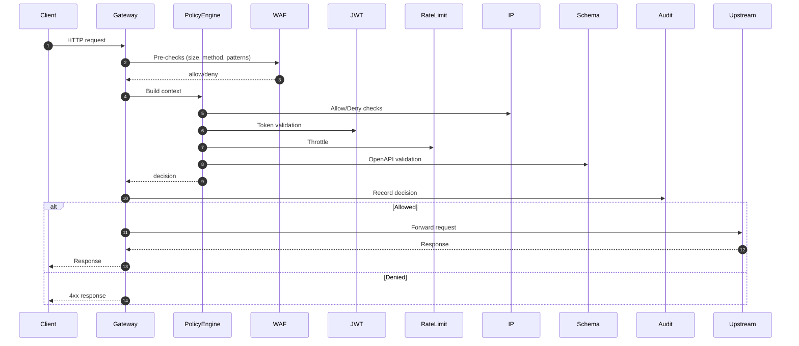

# Architecture

The gateway is a non-blocking reverse proxy that enforces ordered, composable security policies before forwarding traffic.

## Request Flow

## Core Components

- `/proxy`: Route matching, request forwarding, and response bridging
- `/policy`: Ordered policy evaluation and decision aggregation
- `/security`: JWT validation, API key hashing, and IP CIDR matching
- `/waf`: WAF-lite checks and payload inspection
- `/audit`: Structured decision logging and persistent audit trail
- `/admin`: Control plane APIs to manage routes and policies
- `/infra`: Database entities/repositories, caching, and external clients
